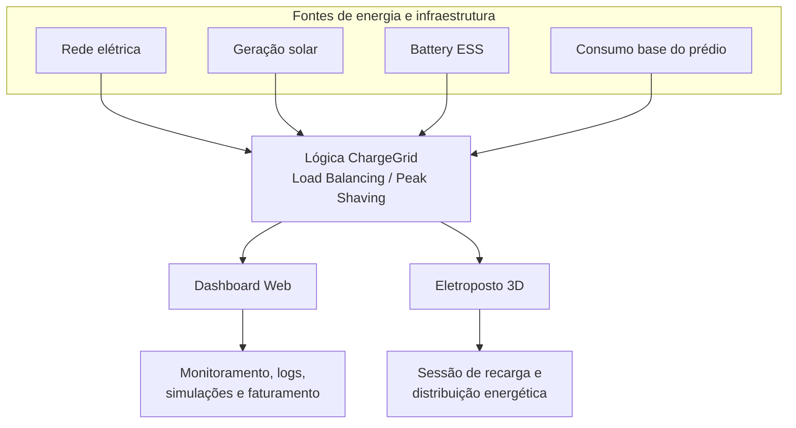
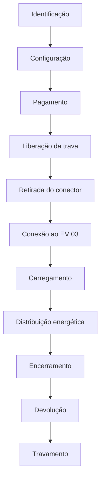
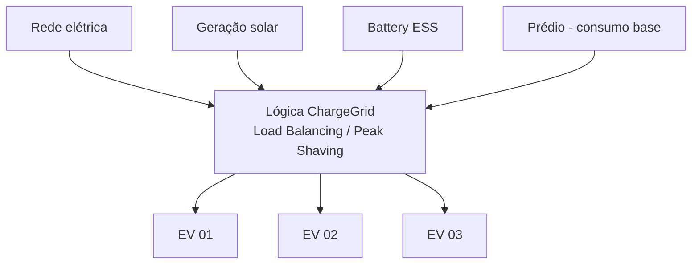

# GoodWe ChargeGrid Intelligence

**GoodWe Challenge 2026 — FIAP | Sprint 3**

**Equipe 7 — Turma 1CCPX**

| Nome | RM |
|---|---|
| Gabriel Barbosa Furin | 572941 |
| Gabriel de Almeida Santos | 569395 |
| Herbert Soares de Jesus | 571507 |
| Lucas Kiodi Moraca | 571004 |
| Renan Fracalossi Mano da Silva | 569610 |

---

Solução de gerenciamento inteligente de recarga de veículos elétricos desenvolvida para o **GoodWe Challenge 2026** — FIAP, Sprint 3.

O ChargeGrid é um **único produto** com duas interfaces complementares: um **Dashboard Web** de gestão e monitoramento e um **Eletroposto 3D** de demonstração da operação simulada de uma sessão de recarga. A partir desta Sprint, o projeto também conta com um **script Python** que isola a lógica de gerenciamento energético (Load Balancing e Peak Shaving) como camada de lógica pura, independente das interfaces.

---

## Artefatos principais da Sprint 3

### Eletroposto 3D

Demonstração da operação física/simulada do eletroposto e do fluxo completo de uma sessão de recarga.

| Arquivo | Descrição |
|---|---|
| `index_V8_1_SPRINT3.html` | Interface 3D principal |
| `ChargeGrid_Web.glb` | Modelo 3D do eletroposto |

### Dashboard Web

Interface de gestão, monitoramento e visualização da operação.

🔗 **[https://goodwe-grid-smart.lovable.app/](https://goodwe-grid-smart.lovable.app/)**

### Simulador Python

Script de terminal que demonstra a lógica de gerenciamento energético (potência disponível, Load Balancing e Peak Shaving) de forma independente das interfaces gráficas.

| Arquivo | Descrição |
|---|---|
| `src/simulador/chargegrid_engine.py` | Módulo com a lógica pura (importável e testável) |
| `src/simulador/chargegrid_simulador.py` | Script executável com logs no estilo OCPP |

### Documentação técnica

| Arquivo | Conteúdo |
|---|---|
| [ARQUITETURA.md](ARQUITETURA.md) | Arquitetura, componentes, lógica energética e visão futura |
| [VALIDACAO.md](VALIDACAO.md) | Casos de validação, escopo validado e limitações |
| [docs/casos_de_uso.md](docs/casos_de_uso.md) | Casos de uso do Dashboard Web e da jornada Mobile/Eletroposto |
| [docs/diagramas/diagrama_blocos.md](docs/diagramas/diagrama_blocos.md) | Diagrama de blocos do produto |
| [docs/diagramas/fluxograma_sessao.md](docs/diagramas/fluxograma_sessao.md) | Fluxograma da sessão de recarga |

---

## 1. Equipe

A equipe está listada no cabeçalho, no topo deste documento.

---

## 2. Visão geral da solução

O **GoodWe ChargeGrid Intelligence** é uma proposta de plataforma de gerenciamento energético para estações de recarga de veículos elétricos em ambientes comerciais.

As interfaces são **complementares** e representam o mesmo conceito de produto:

| Interface | Função |
|---|---|
| **Dashboard Web** | Gestão, monitoramento, balanceamento, logs, simulações e faturamento |
| **Eletroposto 3D** | Demonstração da operação física/simulada da sessão de recarga |
| **Simulador Python** | Demonstração em terminal da lógica energética (Load Balancing / Peak Shaving) |

---

## 3. Problema

Em ambientes comerciais com múltiplos veículos elétricos carregando simultaneamente — shopping centers, empresas, estacionamentos, prédios — a demanda elétrica pode aumentar significativamente e superar os limites contratados com a concessionária.

Sem gerenciamento, esse cenário pode gerar picos de demanda com impacto tarifário, sobrecarga da infraestrutura e ineficiência no uso de fontes renováveis e armazenamento.

---

## 4. Objetivo

O ChargeGrid coordena a potência disponível considerando:

- consumo base do prédio;
- limite da rede elétrica;
- geração solar;
- Battery ESS (armazenamento);
- potência demandada pelos veículos;
- Load Balancing;
- Peak Shaving.

O objetivo da Sprint 3 é demonstrar esse conceito por meio de um **Dashboard Web** funcional, de um **protótipo 3D interativo** e de um **script Python** que evidencia a lógica energética de forma isolada e testável.

---

## 5. Status das funcionalidades

> **Legenda:**
> - ✅ **Implementado** — presente e funcional no protótipo/interface.
> - 🔶 **Simulado** — comportamento demonstrado com dados/regras simuladas, sem integração física ou serviço real.
> - 🔲 **Planejado** — evolução futura; **não é requisito da Sprint 3 atual**.

| Funcionalidade | Status |
|---|---|
| Dashboard Web | ✅ Implementado |
| Eletroposto 3D | ✅ Implementado |
| Simulador Python (lógica energética) | ✅ Implementado |
| Fluxo da sessão de recarga | 🔶 Simulado |
| Distribuição energética | 🔶 Simulado |
| Load Balancing | 🔶 Simulado |
| Peak Shaving | 🔶 Simulado |
| Geração solar | 🔶 Simulado |
| Battery ESS | 🔶 Simulado |
| Logs inspirados em OCPP | 🔶 Simulado |
| IA / Previsão | 🔶 Simulado / Demonstração |
| Simulador "E Se..." | ✅ Implementado / 🔶 Simulado |
| Faturamento | 🔶 Simulado |
| Pagamento PIX real | 🔲 Planejado |
| Pagamento cartão real | 🔲 Planejado |
| Backend / Charge Engine | 🔲 Planejado |
| Banco de dados persistente | 🔲 Planejado |
| CSMS / OCPP real | 🔲 Planejado |
| Edge Gateway / Raspberry Pi | 🔲 Planejado |
| Integração física com equipamentos GoodWe | 🔲 Planejado |
| Machine Learning treinado | 🔲 Planejado |

---

## 6. Arquitetura



Para detalhes completos, consulte [ARQUITETURA.md](ARQUITETURA.md) e [docs/diagramas/diagrama_blocos.md](docs/diagramas/diagrama_blocos.md).

---

## 7. Dashboard Web

🔗 **[https://goodwe-grid-smart.lovable.app/](https://goodwe-grid-smart.lovable.app/)**

Interface de **gestão e monitoramento** da operação ChargeGrid.

| Área | Descrição |
|---|---|
| Painel Geral | Visão consolidada da operação — demanda, sessões ativas, indicadores |
| Balanceamento | Distribuição de potência entre estações e veículos |
| Estações | Status dos carregadores, potência e sessões em andamento |
| Logs OCPP | Eventos operacionais com nomenclatura inspirada em OCPP (simulados) |
| IA & Previsão | Área demonstrativa de análise e previsão de demanda |
| Simulador "E Se..." | Simulação de cenários alternativos de gerenciamento |
| Faturamento | Relatórios e indicadores financeiros simulados |
| Usuários & Frotas | Gestão de usuários e frotas (protótipo) |

O Dashboard utiliza uma camada local de dados simulados — **LiveDataProvider** — atualizada aproximadamente a cada 2 segundos, sem dependência de backend ou hardware físico.

> ⚠️ Os logs OCPP são **gerados localmente** e não representam comunicação OCPP real. A área de IA/Previsão é **demonstrativa** — não existe modelo de Machine Learning treinado.

**Parâmetros do cenário do Dashboard** *(independentes do Eletroposto 3D e do Simulador Python)*:

| Parâmetro | Valor |
|---|---|
| Limite da rede | 200 kW |
| Consumo base | 120 kW |
| Carregadores | até 22 kW cada |

---

## 8. Eletroposto 3D

Protótipo interativo que demonstra a **operação física/simulada** do eletroposto e o fluxo completo de uma sessão de recarga.

**O que o Eletroposto 3D demonstra:**

- Geração solar e contribuição renovável
- Rede elétrica e limite de demanda
- Battery ESS (armazenamento de energia)
- Consumo base do prédio
- EV 01, EV 02 e EV 03 com demandas distintas
- Distribuição automática de energia entre as fontes e cargas
- Indicadores em tempo real: tempo de sessão, energia entregue, custo, percentual renovável

---

## 9. Fluxo da sessão



> O fluxo é **simulado**. Não existe hardware físico, OCPP real ou processamento de pagamento real.

Detalhamento de cada etapa em [docs/diagramas/fluxograma_sessao.md](docs/diagramas/fluxograma_sessao.md) e casos de uso relacionados em [docs/casos_de_uso.md](docs/casos_de_uso.md).

---

## 10. Parâmetros da simulação 3D

> ⚠️ Valores **exclusivos do Eletroposto 3D** — usados também pelo Simulador Python, e independentes dos parâmetros do Dashboard.

| Parâmetro | Valor |
|---|---|
| Limite da rede | **35 kW** |
| Consumo base do prédio | **32 kW** |
| Battery ESS | **60 kWh** |
| SOC inicial da bateria | **72%** |
| EV 01 | até **18 kW** |
| EV 02 | até **12 kW** |
| EV 03 — Economy | até **20 kW** |
| EV 03 — Fast | até **28 kW** |
| Velocidade da simulação | **60×** |

### Justificativa dos parâmetros

Os valores foram escolhidos para representar um **cenário comercial com restrição de demanda**. O limite da rede de 35 kW e o consumo base do prédio de 32 kW deixam uma margem inicial pequena (≈ 3 kW) para a recarga dos veículos, criando a necessidade de geração solar e Battery ESS para que os EVs possam ser carregados de forma significativa.

As potências distintas dos EVs permitem demonstrar diferentes níveis de demanda e observar a atuação das regras de Load Balancing e Peak Shaving ao longo da simulação — tanto no Eletroposto 3D quanto no Simulador Python.

> ⚠️ Esses valores são **exclusivamente simulados** e **não representam** dimensionamento elétrico real, homologação, especificação de instalação ou validação de engenharia.

---

## 11. Distribuição energética



---

## 12. Load Balancing e Peak Shaving

### Load Balancing *(simulado)*

Distribui a potência disponível entre os veículos de acordo com as condições do cenário, garantindo que a soma das cargas respeite o limite da rede.

### Peak Shaving *(simulado)*

Quando a demanda simulada aumenta, o sistema reduz temporariamente a potência destinada aos carregadores para evitar um pico de demanda na rede.

Ambas as regras estão implementadas em Python de forma pura e testável em [`src/simulador/chargegrid_engine.py`](src/simulador/chargegrid_engine.py), além de demonstradas no Dashboard e no Eletroposto 3D.

---

## 13. Tecnologias

### Dashboard Web

| Categoria | Tecnologias |
|---|---|
| Framework / Linguagem | React 18, TypeScript, Vite |
| UI | Tailwind CSS, shadcn/ui, Radix UI, Lucide React |
| Roteamento | React Router |
| Gráficos | Recharts |
| Mapas | Leaflet, OpenStreetMap |
| Dados assíncronos | TanStack React Query |
| Testes | Vitest |

### Eletroposto 3D

| Categoria | Tecnologias |
|---|---|
| Linguagens | HTML, CSS, JavaScript |
| 3D | Three.js, GLTFLoader, PointerLockControls |
| Modelo | GLB (ChargeGrid_Web.glb) |

### Simulador Python

| Categoria | Tecnologias |
|---|---|
| Linguagem | Python 3.9+ |
| Dependências | Nenhuma — apenas biblioteca padrão (`dataclasses`, `math`, `time`, `datetime`, `typing`) |

---

## 14. Justificativa técnica

A escolha de tecnologias por artefato buscou equilibrar **finalidade de cada interface** com os conceitos de **eficiência energética e automação** trabalhados na disciplina:

- **React + TypeScript (Dashboard Web):** um dashboard de monitoramento precisa reagir a atualizações de estado com frequência (a cada ~2 s, no `LiveDataProvider`) sem recarregar a página. O modelo de componentes do React é adequado para esse tipo de atualização reativa, e o TypeScript adiciona tipagem estática sobre entidades sensíveis do domínio energético (potência, sessões, carregadores), reduzindo a chance de erros de estado — algo especialmente relevante ao representar automações de controle de carga.

- **HTML + Three.js (Eletroposto 3D):** a proposta aqui é uma demonstração **espacial** da operação física do eletroposto (posicionamento de fontes, veículos e fluxos de energia), algo mais natural em uma cena 3D do que em uma interface tabular. HTML + Three.js permite isso sem necessidade de build ou backend, o que favorece a portabilidade do protótipo (basta um servidor HTTP estático).

- **Python (Simulador / lógica energética):** a lógica de cálculo de potência disponível, Load Balancing e Peak Shaving é, em essência, um problema de **regras e automação de decisão** — não de interface. Isolar essa lógica em Python puro (sem dependências externas) permite que ela seja **testada e auditada independentemente** das interfaces gráficas, reforçando a ideia de que a automação energética deveria ser uma camada própria do sistema (aproximando-se conceitualmente de um futuro "Charge Engine" — ver seção de arquitetura futura). Python também é uma linguagem comum em prototipagem de lógica de engenharia e ciência de dados, o que facilita a evolução futura para modelos de previsão de demanda.

---

## 15. Conexão com os conteúdos da disciplina

| # | Conteúdo da disciplina | Como se aplica no ChargeGrid |
|---|---|---|
| 1 | Lógica e tomada de decisão | Regras de distribuição de potência e controle de demanda |
| 2 | Automação / IoT | Conceito de coleta de dados e atuação automática sobre cargas |
| 3 | Gestão de estações e sessões | Monitoramento de carregadores, veículos e sessões ativas |
| 4 | Logs operacionais | Eventos simulados com nomenclatura inspirada em OCPP |
| 5 | Load Balancing | Distribuição da potência disponível entre múltiplos EVs |
| 6 | Peak Shaving | Redução da demanda em períodos de pico |
| 7 | Geração solar | Fonte renovável integrada ao cenário energético |
| 8 | Battery ESS | Armazenamento energético como buffer de demanda |
| 9 | Sustentabilidade | Melhor aproveitamento das fontes e infraestrutura existente |
| 10 | Eficiência energética | Coordenação entre consumo, geração, armazenamento e recarga |

---

## 16. Uso de simulações

O Dashboard Web, o Eletroposto 3D e o Simulador Python permitem testar estratégias de automação e gerenciamento energético em um **ambiente controlado, sem risco físico**.

A simulação demonstra sessões de recarga, distribuição de potência, Load Balancing, Peak Shaving, geração solar, Battery ESS e indicadores operacionais (energia, tempo, custo, percentual renovável), funcionando como uma **validação de conceito** antes de uma eventual implementação física.

---

## 17. Resultados funcionais

- Dashboard Web publicado e acessível via navegador.
- Eletroposto 3D funcional com o fluxo completo da sessão demonstrado.
- Simulador Python executável em terminal, com lógica energética isolada e testável.
- Distribuição energética simulada com EV 01, EV 02, EV 03, geração solar e Battery ESS.
- Logs operacionais com nomenclatura inspirada em OCPP.
- Load Balancing e Peak Shaving demonstrados nas três interfaces.
- Indicadores em tempo real: demanda, energia, custo, percentual renovável.

---

## 18. Evidências

### Dashboard Web

| Evidência | Arquivo |
|---|---|
| Painel Geral | [Dashboard/Painel/dashboard_painel_geral.png](Dashboard/Painel/dashboard_painel_geral.png) |
| Balanceamento | [Dashboard/Painel/dashboard_balanceamento.png](Dashboard/Painel/dashboard_balanceamento.png) |
| Faturamento | [Dashboard/Painel/dashboard_faturamento.png](Dashboard/Painel/dashboard_faturamento.png) |

### Eletroposto 3D

| Evidência | Arquivo |
|---|---|
| Visão geral | [Eletroposto_3D/eletroposto_visao_geral.png](Eletroposto_3D/eletroposto_visao_geral.png) |
| Sessão de recarga | [Eletroposto_3D/eletroposto_sessao_recarga.png](Eletroposto_3D/eletroposto_sessao_recarga.png) |
| Energy Engine | [Eletroposto_3D/eletroposto_energy_engine.png](Eletroposto_3D/eletroposto_energy_engine.png) |

---

## 19. Demonstração e Resultados (Simulador Python)

Log de saída real do `chargegrid_simulador.py`, usando os parâmetros do Eletroposto 3D (rede 35 kW, prédio 32 kW, ESS 60 kWh/72%, EV01 18 kW, EV02 12 kW, EV03-Fast 28 kW). A demanda total dos três veículos (58 kW) supera a potência disponível, o que aciona o Peak Shaving a cada passo, enquanto o Load Balancing distribui a potência resultante (automação em tempo real) entre os veículos:

```
========================================================================
GoodWe ChargeGrid Intelligence - Simulador de sessao (Eletroposto 3D)
Cenario: rede 35 kW | predio 32 kW | ESS 60 kWh (SOC inicial 72%)
========================================================================
[23:03:22] BootNotification     Eletroposto conectado - status: Available
[23:03:22] Authorize            Usuario identificado - sessao autorizada
[23:03:22] StartTransaction     Modo selecionado: EV03-Fast (28 kW) - conector liberado
[00:03:22] MeterValues          solar=1.6kW ess=15.0kW disponivel=19.6kW | EV01=5.5kW, EV02=3.6kW, EV03-Fast=8.5kW
[00:03:22] StatusNotification   Peak Shaving ACIONADO - demanda 58.0kW > disponivel 19.6kW -> potencia total reduzida para 17.6kW
[01:03:22] MeterValues          solar=3.1kW ess=15.0kW disponivel=21.1kW | EV01=5.9kW, EV02=3.9kW, EV03-Fast=9.2kW
[01:03:22] StatusNotification   Peak Shaving ACIONADO - demanda 58.0kW > disponivel 21.1kW -> potencia total reduzida para 19.0kW
...
[07:03:22] MeterValues          solar=9.5kW ess=15.0kW disponivel=27.5kW | EV01=7.7kW, EV02=5.1kW, EV03-Fast=11.9kW
[07:03:22] StatusNotification   Peak Shaving ACIONADO - demanda 58.0kW > disponivel 27.5kW -> potencia total reduzida para 24.8kW
[08:03:22] StopTransaction      Sessao encerrada pelo usuario
[08:03:22] StatusNotification   Conector devolvido - trava reativada
========================================================================
Fim da simulacao. Todos os valores acima sao simulados (sem hardware real).
========================================================================
```

Esse log já é evidência funcional (saída real da execução, não um exemplo inventado — reproduza com `python src/simulador/chargegrid_simulador.py`). Prints de tela do terminal podem complementar essa evidência:

*(Prints da execução a serem adicionados em `docs/evidencias/`)*

| Evidência | Arquivo |
|---|---|
| Inicialização e logs | `docs/evidencias/python_boot_notification.png` |
| Load Balancing em ação | `docs/evidencias/python_load_balancing.png` |
| Peak Shaving acionado | `docs/evidencias/python_peak_shaving.png` |
| Sessão completa | `docs/evidencias/python_sessao_completa.png` |

---

## 20. Como executar

### Dashboard Web

Acesso direto pelo navegador:

```
https://goodwe-grid-smart.lovable.app/
```

### Eletroposto 3D

`index_V8_1_SPRINT3.html` e `ChargeGrid_Web.glb` devem estar no mesmo diretório. Execute um servidor HTTP local:

```bash
python -m http.server 8000
```

Acesse:

```
http://localhost:8000/index_V8_1_SPRINT3.html
```

> ⚠️ Abrir o `.html` diretamente como arquivo local pode bloquear o carregamento do modelo 3D. Use sempre o servidor HTTP.

### Simulador Python

```bash
pip install -r requirements.txt
python src/simulador/chargegrid_simulador.py
```

> Não há dependências externas — o `requirements.txt` existe para documentar o processo de instalação, mas o script roda apenas com a biblioteca padrão do Python (>= 3.9).

---

## 21. Estrutura do repositório

```
Sprint-3-Python/
├── Dashboard/
│   ├── Painel/
│   │   ├── dashboard_balanceamento.png
│   │   ├── dashboard_faturamento.png
│   │   └── dashboard_painel_geral.png
│   ├── src/
│   │   ├── components/dashboard/
│   │   │   └── LiveDataProvider.tsx
│   │   ├── lib/
│   │   │   └── utils.ts
│   │   └── test/
│   │       ├── liveprovider.test.ts
│   │       └── setup.ts
│   ├── App.tsx
│   ├── main.tsx
│   ├── package.json
│   ├── vite.config.ts
│   ├── vitest.config.ts
│   ├── tsconfig.json
│   ├── tsconfig.app.json
│   ├── tsconfig.node.json
│   ├── components.json
│   ├── eslint.config.js
│   ├── postcss.config.js
│   ├── index.html
│   └── README.md
├── Eletroposto_3D/
│   ├── eletroposto_energy_engine.png
│   ├── eletroposto_sessao_recarga.png
│   └── eletroposto_visao_geral.png
├── docs/
│   ├── casos_de_uso.md
│   ├── diagramas/
│   │   ├── diagrama_blocos.md
│   │   └── fluxograma_sessao.md
│   └── evidencias/
│       └── (prints da execução do simulador Python)
├── src/
│   └── simulador/
│       ├── chargegrid_engine.py
│       └── chargegrid_simulador.py
├── ARQUITETURA.md
├── ChargeGrid_Web.glb
├── LICENSE
├── README.md
├── requirements.txt
├── VALIDACAO.md
└── index_V8_1_SPRINT3.html
```

---

## 22. Limitações

- O Dashboard utiliza **dados simulados/localmente gerados** — não existe backend de produção.
- O Eletroposto 3D utiliza **simulação** — não existe hardware físico.
- O Simulador Python é uma **prova de conceito de lógica** — não está integrado a nenhuma das interfaces gráficas nem a hardware real.
- Os logs são **inspirados em OCPP**, mas **não representam comunicação OCPP real**.
- A área de IA/Previsão é **demonstrativa** — não existe modelo de Machine Learning treinado.
- O faturamento é **simulado** — não existe processamento financeiro real.
- Não existe banco de dados persistente, integração física com carregadores GoodWe, Edge Gateway físico, pagamento real, aplicativo mobile publicado ou ML treinado e validado.
- Todos os valores de potência, energia, custo e demais indicadores são **exclusivamente demonstrativos**.

Para detalhes completos sobre o escopo validado e não validado, consulte [VALIDACAO.md](VALIDACAO.md).

---

## 23. Arquitetura futura e próximos passos

A arquitetura futura planejada inclui componentes ainda não implementados:

- Backend / Charge Engine (possivelmente evoluído a partir da lógica em `src/simulador/chargegrid_engine.py`)
- Banco de dados persistente
- CSMS / OCPP real
- Edge Gateway (ex: Raspberry Pi)
- Integração física com equipamentos GoodWe
- Aplicativo mobile (ver casos de uso conceituais em [docs/casos_de_uso.md](docs/casos_de_uso.md))
- ML / Previsões treinadas com dados históricos
- Pagamentos reais (PIX, cartão)

> ⚠️ Esses itens são **evolução futura** e **não fazem parte do escopo da Sprint 3 atual**. Essa evolução poderá continuar em futuras Sprints, em uma prova de conceito física ou na continuidade do próprio Challenge GoodWe.

---

## 24. Links e documentação

| Recurso | Link |
|---|---|
| Dashboard Web | [https://goodwe-grid-smart.lovable.app/](https://goodwe-grid-smart.lovable.app/) |
| Arquitetura | [ARQUITETURA.md](ARQUITETURA.md) |
| Validação | [VALIDACAO.md](VALIDACAO.md) |
| Casos de uso | [docs/casos_de_uso.md](docs/casos_de_uso.md) |
| Diagrama de blocos | [docs/diagramas/diagrama_blocos.md](docs/diagramas/diagrama_blocos.md) |
| Fluxograma da sessão | [docs/diagramas/fluxograma_sessao.md](docs/diagramas/fluxograma_sessao.md) |
