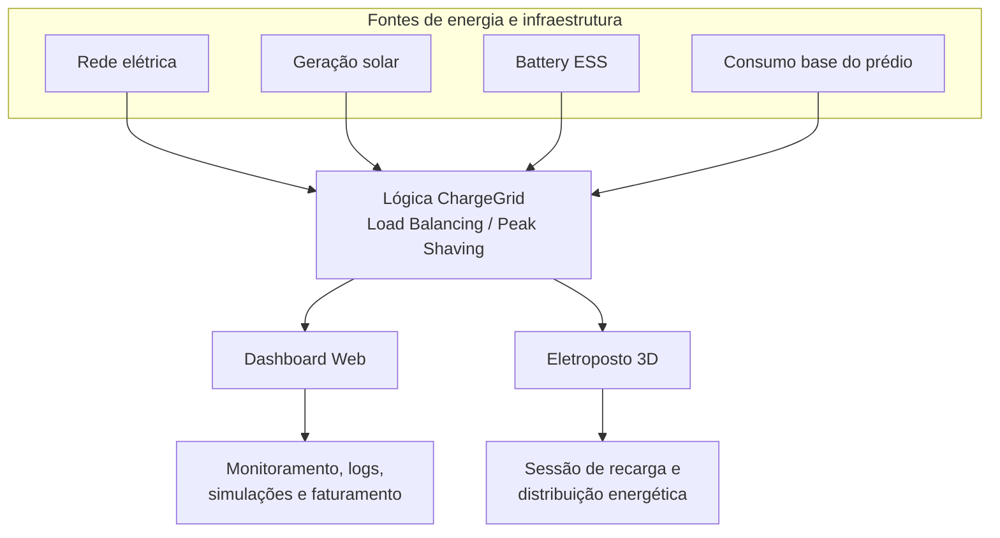

# Diagrama de Blocos — GoodWe ChargeGrid Intelligence

**GoodWe Challenge 2026 — FIAP | Sprint 3 | Equipe 7**

Visão geral dos blocos funcionais do produto ChargeGrid: como as fontes de energia e a infraestrutura alimentam a lógica de gerenciamento, e como essa lógica se conecta às duas interfaces do produto.

> ⚠️ Todos os blocos de fontes de energia, Battery ESS e lógica de gerenciamento são **simulados**. Não existe integração real com equipamentos físicos, sensores ou medidores.

## Leitura do diagrama

| Bloco | Papel |
|---|---|
| Rede elétrica | Fonte principal de alimentação, com limite contratado |
| Geração solar | Fonte renovável complementar (simulada) |
| Battery ESS | Armazenamento de energia — buffer de demanda (simulado) |
| Consumo do prédio | Carga fixa que é sempre atendida primeiro |
| Lógica ChargeGrid | Calcula a potência disponível e aplica Load Balancing e Peak Shaving |
| Dashboard Web | Interface de gestão e monitoramento (React/TypeScript) |
| Eletroposto 3D | Interface de demonstração da sessão de recarga (HTML + Three.js) |

Ver também: [fluxograma_sessao.md](fluxograma_sessao.md), [../casos_de_uso.md](../casos_de_uso.md), [../../ARQUITETURA.md](../../ARQUITETURA.md).
