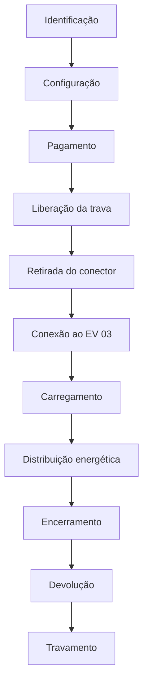

# Fluxograma da Sessão de Recarga — Eletroposto 3D

**GoodWe Challenge 2026 — FIAP | Sprint 3 | Equipe 7**

Ciclo completo de uma sessão de recarga simulada no Eletroposto 3D, do reconhecimento do usuário até o travamento final do conector.

> ⚠️ Fluxo **completamente simulado**. Não existe hardware físico, comunicação OCPP real ou processamento de pagamento real.

## Descrição das etapas

| Etapa | Descrição |
|---|---|
| Identificação | Usuário é identificado no eletroposto (simulado) |
| Configuração | Escolha do modo de recarga (Economy ou Fast) para o EV 03 |
| Pagamento | Tela de pagamento exibida (sem processamento financeiro real) |
| Liberação da trava | Trava do conector é liberada na simulação |
| Retirada do conector | Conector fica disponível para uso |
| Conexão ao EV 03 | Conector é conectado ao veículo na cena 3D |
| Carregamento | Sessão de carregamento iniciada; indicadores começam a atualizar |
| Distribuição energética | Potência é distribuída entre rede, solar, ESS e os veículos (Load Balancing / Peak Shaving) |
| Encerramento | Sessão é encerrada pelo usuário ou automaticamente |
| Devolução | Conector é devolvido ao suporte |
| Travamento | Trava é reativada, eletroposto volta ao estado "Available" |

Ver também: [diagrama_blocos.md](diagrama_blocos.md), [../casos_de_uso.md](../casos_de_uso.md), [../../ARQUITETURA.md](../../ARQUITETURA.md).
